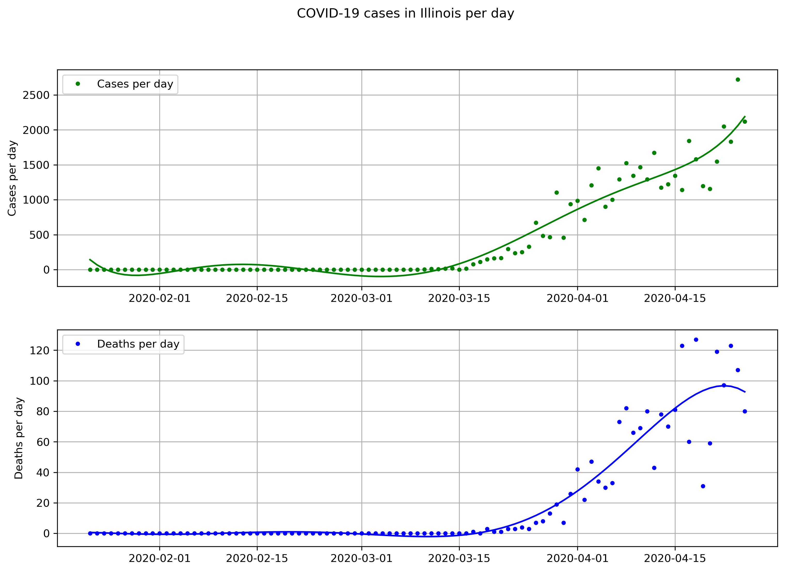

# simple-covid-analyzer
---

A basic Python tool for visualizing the growth of COVID-19 cases in the US by state. The dataset is available on the Github repository [covid-19](https://github.com/datasets/covid-19). 

### Sample code:
```
from functions import *

cdf = fetch_data()    # cases data
cdf = slice_fit(cdf, state='Illinois')

ddf = fetch_data(cases_data=False)    # deaths data
ddf = slice_fit(ddf, state='Illinois')

plot(deathdf=ddf, casedf=cdf, state='Illinois')

```

### Output:



