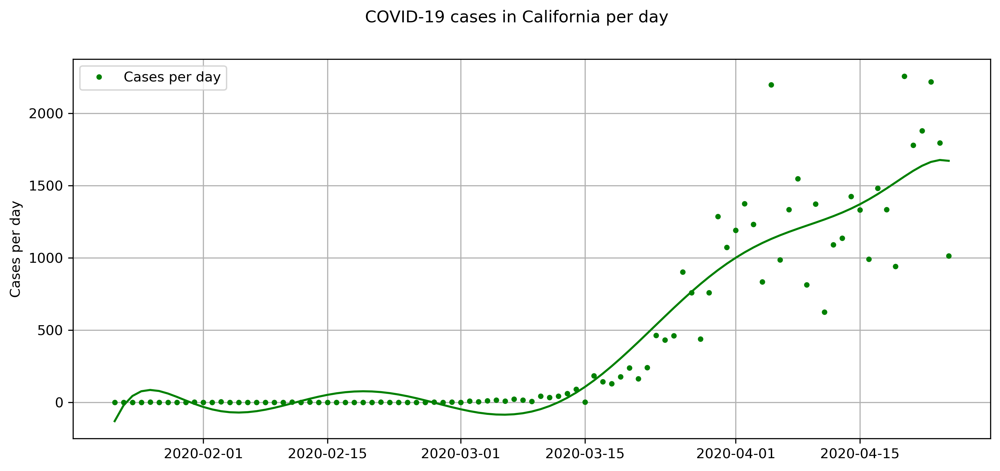

# simple-covid-analyzer
---

A basic Python tool for visualizing the growth of COVID-19 cases in the US by state. The dataset is available on the Github repository [covid-19](https://github.com/datasets/covid-19). 

### Sample code:
```
from functions import *

if __name__ == '__main__':
    state = 'California'
    cdf = fetch_data()
    cdf = slice_fit(cdf, state=state)
    plot(casedf=cdf, state=state)
```

### Output:



