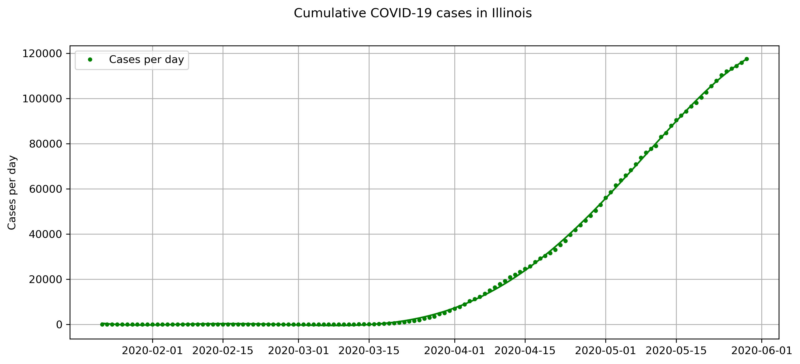

# simple-covid-visualizer
---

A basic Python tool for visualizing the growth of COVID-19 cases in the US by state. I borrow the dataset from the Github repository [covid-19](https://github.com/datasets/covid-19). The code is written in Python using packages `matplotlib`, `numpy` and `pandas`. See the [functions file](code/functions.py) for explicit code. 

### Sample code:
```
from functions import *

casedf = fetch_data()    # cases dataset
deathdf = fetch_data(cases_data=False)    # deaths dataset

state = 'Illinois'
illinois_cases = slice_fit(casedf)
illinois_deaths = slice_fit(deathdf)
plot(deathdf=illinois_deaths, casedf=illinois_deaths)
```

Produces the following output:


To visualize cumulative cases/deaths, set the `cumulative=True` argument in the `plot` function:

```
    # Illinois cases (cumulative)
    state = 'Illinois'
    plot(casedf=illinois_cases, fit=True, cumulative=True)
```

